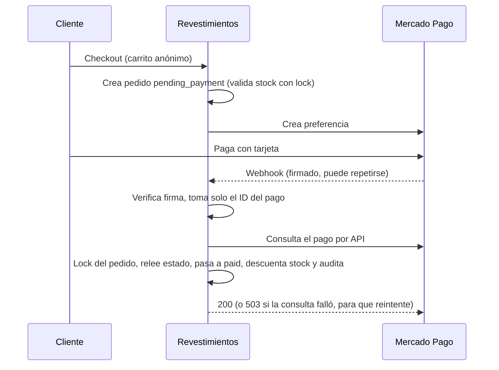

# Revestimientos

[](https://github.com/gsciancalepore/revestimientos/actions/workflows/ci.yml)


Backend de e-commerce con pagos de Mercado Pago, stock concurrente y
observabilidad por logs estructurados. **Proyecto personal**: el dominio (una
casa que vende cerámicas y revestimientos) es el escenario; el objetivo es
resolver bien los problemas de backend que aparecen cuando hay plata y stock en
juego.

<!-- TODO: 2-3 capturas o un GIF (catálogo con calculadora m² → cajas, checkout, panel de pedidos) -->

## Stack

PHP 8.4 · Laravel 12 · PostgreSQL 17 · Redis · Docker Compose · Blade + Tailwind 4 + Alpine ·
Pest · PHPStan (nivel 8) · Laravel Pint · GitHub Actions · Mercado Pago · Render + Neon (staging)

## Problemas de ingeniería que resuelve

**Idempotencia del webhook de Mercado Pago.** Mercado Pago reintenta las
notificaciones por diseño, así que dos llegadas del mismo pago en simultáneo son
el caso esperado. La confirmación abre la transacción bloqueando el pedido
(`lockForUpdate`) y **relee su estado adentro**: si ya está pagado, no hace nada.
Sin eso, el stock se descontaría dos veces.

**No confiar en el contenido de la notificación.** Del webhook se toma solo el
ID del pago, después de verificar la firma. Estado, monto y referencia se
consultan a la API de Mercado Pago. El código de respuesta es deliberado: `200`
cuando no hay nada que hacer, `503` cuando la consulta falla por causa
transitoria, para que Mercado Pago reintente en vez de perder el pago.

**Stock concurrente sin deadlocks.** El stock baja al confirmarse el pago
([ADR-005](docs/adr/ADR-005-gestion-stock.md)). Los productos se bloquean
ordenados por `id` para que dos transacciones sobre los mismos productos no se
traben entre sí, y las cantidades salen del snapshot del pedido, no del producto.

**Una decisión de negocio que parece un bug.** Un pago ya cobrado nunca se
rechaza por falta de stock: el pedido pasa a pagado, el stock puede quedar
negativo y se audita para reponer. El comercio compra directo al fabricante, y
un pedido cobrado que no puede avanzar es peor que un stock negativo. Evalué la
alternativa (reservar stock al crear el pedido) y la descarté por la
infraestructura que exigía; el análisis está en
[ADR-012](docs/adr/ADR-012-reserva-stock-al-crear-pedido.md).

**Dinero sin floats.** Montos en centavos (`int`/`BIGINT`) y `bcmath` para las
conversiones m² → cajas → precio ([ADR-003](docs/adr/ADR-003-unidades-m2-cajas-dinero.md)).

**Máquina de estados del pedido.** Las transiciones viven en un enum y hay un
único caso de uso que escribe el estado y lo audita.

## Flujo de pago



## Cómo trabajo

- **Spec antes que código.** Cada funcionalidad tiene una spec aprobada con
  reglas numeradas y criterios de aceptación ([`docs/specs/`](docs/specs/)), y
  las decisiones importantes quedan en [ADRs](docs/adr/), incluidas las
  descartadas.
- **TDD** (red → green → refactor), más de 450 tests en Pest contra PostgreSQL
  real, y CI con Pint → PHPStan nivel 8 → Pest en cada Pull Request.
- **Los gates no alcanzan.** Una regla estuvo seis días cobrando el subtotal en
  lugar del total con CI en verde: los tests pasaban, pero ninguno se ponía rojo
  si la regla estaba mal. Desde entonces, antes de cada push, un agente de
  revisión ([`.claude/agents/`](.claude/agents/)) **muta la implementación de
  cada regla y comprueba que algún test falle**.

## Observabilidad

La app escribe logs JSON por línea según un **contrato versionado**, con ID de
request y sin datos personales
([ADR-013](docs/adr/ADR-013-capa-observabilidad.md),
[`docs/observabilidad/`](docs/observabilidad/README.md)). El contrato está
pensado para que un sistema externo lo consuma sin conocer el código: lo uso en
un proyecto aparte, un agente de IA que investiga incidentes a partir de estos
logs.
<!-- TODO: link al repo del investigador de incidentes cuando sea público -->

## Limitaciones conocidas y próximos pasos

- Sin métricas ni dashboards todavía: la observabilidad arranca solo por logs (ADR-013).
- Sin vencimiento automático de pedidos impagos (no hay scheduler en ningún entorno; ver ADR-012).
- Pendiente: Spec Higiene 03.b. El resto, en el [roadmap](docs/roadmap.md).

## Levantarlo en local

Requisito: Docker + Docker Compose. No hace falta PHP ni Node en el host.

```bash
make setup     # contenedores, dependencias, migraciones y seed (idempotente)
make npm-dev   # dev server de Vite
```

Web: <http://localhost:8080> · Panel: <http://localhost:8080/admin/login>
(`admin@ceramica.local` / `admin1234`, desde `.env.example`; se configuran con
`ADMIN_NAME`, `ADMIN_EMAIL` y `ADMIN_PASSWORD`) · Mailpit: <http://localhost:8025> ·
Vite: <http://localhost:5173>

## Documentación

- **Principios del proyecto** (constitución): [`PROJECT_PRINCIPLES.md`](PROJECT_PRINCIPLES.md)
- **Visión**: [`docs/vision.md`](docs/vision.md)
- **Lenguaje ubicuo** (glosario): [`docs/ubiquitous-language.md`](docs/ubiquitous-language.md)
- **Definición de dominio**: [`docs/specs/00-dominio.md`](docs/specs/00-dominio.md)
- **Spec 01 — Autenticación y roles**: [`docs/specs/01-autenticacion-roles.md`](docs/specs/01-autenticacion-roles.md)
- **Spec 02 — Panel + Categorías**: [`docs/specs/02-panel-categorias.md`](docs/specs/02-panel-categorias.md)
- **Spec 03 — Productos**: [`docs/specs/03-productos.md`](docs/specs/03-productos.md)
- **Spec 04 — Catálogo público**: [`docs/specs/04-catalogo-publico.md`](docs/specs/04-catalogo-publico.md)
- **Spec 05 — Carrito**: [`docs/specs/05-carrito.md`](docs/specs/05-carrito.md)
- **Spec 06 — Envío por CP**: [`docs/specs/06-envio.md`](docs/specs/06-envio.md) (Fase 1 tarifa por CP), [`docs/specs/06-envio-fase2-importador.md`](docs/specs/06-envio-fase2-importador.md) (Fase 2 importador CSV de tarifas)
- **Spec 07 — Checkout** (compra anónima y creación del pedido): [`docs/specs/07-checkout.md`](docs/specs/07-checkout.md) (Fase 1 estructura), [`docs/specs/07-checkout-fase2.md`](docs/specs/07-checkout-fase2.md) (`PlaceOrderAction`), [`docs/specs/07-checkout-fase3-http.md`](docs/specs/07-checkout-fase3-http.md) (HTTP + formulario), [`docs/specs/07-checkout-fase4-mercadopago.md`](docs/specs/07-checkout-fase4-mercadopago.md) (MercadoPago)
- **Spec 08 — Gestión de pedidos** (implementada; 3 fases: 08.a dominio ✅, 08.b webhook ✅, 08.c panel y despacho ✅): [`docs/specs/08-gestion-pedidos.md`](docs/specs/08-gestion-pedidos.md)
- **Spec Higiene 03 — oferta, calculadora y cobertura** (aprobada; 03.a mergeada, 03.b pendiente): [`docs/specs/higiene-03-oferta-calculadora-cobertura.md`](docs/specs/higiene-03-oferta-calculadora-cobertura.md)
- **Spec Higiene 02 — auditoría, validación y cobertura** (cerrada, precondición de la Spec 08): [`docs/specs/higiene-02-auditoria-validacion-cobertura.md`](docs/specs/higiene-02-auditoria-validacion-cobertura.md)
- **Higiene ShippingRate/AllowedSpecs/UserRole**: [`docs/specs/higiene-01-shippingrate-allowedspecs-userrole.md`](docs/specs/higiene-01-shippingrate-allowedspecs-userrole.md)
- **Spec — Calidad de análisis estático** (PHPStan↔Pest, gates): [`docs/specs/calidad-analisis-estatico.md`](docs/specs/calidad-analisis-estatico.md)
- **Spec — Calidad de onboarding** (runbook y docs para agentes): [`docs/specs/calidad-onboarding.md`](docs/specs/calidad-onboarding.md)
- **Arquitectura**: [`docs/arquitectura.md`](docs/arquitectura.md)
- **Roadmap** (fases + Definition of Done): [`docs/roadmap.md`](docs/roadmap.md)
- **Desarrollo local — probar MercadoPago de punta a punta** (túnel, DNS en WSL2, cuentas de prueba): [`docs/deployment/desarrollo-local.md`](docs/deployment/desarrollo-local.md)
- **Decisiones (ADRs)**: [`docs/adr/`](docs/adr/)
- **Agentes de revisión** (borrador de spec, spec cerrada contra código, y entrega antes del push): [`.claude/agents/`](.claude/agents/) — cuándo usar cada uno, en [`AGENTS.md`](AGENTS.md)


## Comandos útiles

Ejecutar siempre en la raíz del proyecto. Todo comando PHP/Node se ejecuta
**dentro de contenedores** (`docker compose exec app php artisan ...`); el host
no necesita PHP ni Node. El Makefile lo resume:

| Comando | Descripción |
|---|---|
| `make setup` | Primer arranque completo (instala, migra y siembra) |
| `make up` / `make down` | Levantar / detener los servicios |
| `make logs` | Logs del contenedor PHP |
| `tail -f storage/logs/app-$(date -u +%F).jsonl` | Logs de la app en el formato del contrato (JSON por línea, [`docs/observabilidad/`](docs/observabilidad/README.md)) |
| `make shell` | Terminal dentro del contenedor PHP |
| `make artisan cmd="route:list"` | Cualquier comando Artisan (ej: `migrate`, `tinker`) |
| `make migrate` | Aplica migraciones |
| `make seed` | Siembra roles, admin inicial y las 4 categorías (idempotente) |
| `make test` | Suite de tests (Pest, base dedicada `ceramica_test`) |
| `make lint` | Laravel Pint (verifica estilo) |
| `make format` | Aplica estilo con Pint |
| `make stan` | PHPStan nivel 8 (análisis estático) |
| `make composer cmd="show --direct"` | Cualquier comando de Composer |
| `make npm-install` | Instala dependencias de npm (contenedor `assets`) |
| `make npm-dev` | Levanta el dev server de Vite (servicio `assets`, http://localhost:5173) |
| `make npm-build` | Compila los assets para producción |

## Problemas comunes

| Síntoma | Causa | Solución |
|---|---|---|
| La web carga **sin estilos** ("se ve muy mal") | `public/hot` apunta a `0.0.0.0:5173` | Ver regla "Vite en Docker: hot file..." en `.ai/rules/general.md` |
| Tests que renderizan vistas fallan con `ViteManifestNotFoundException` | No hay `public/hot` ni `public/build` | `make npm-dev` (dev) o `make npm-build` antes de testear; en CI se construyen solos (regla en `.ai/rules/tests.md`) |
| El panel no ve roles/permisos nuevos tras un seeder | Cache de permisos de Spatie | `make artisan cmd="permission:cache-reset"` (regla en `.ai/rules/seeders.md`) |
| `ERR_EMPTY_RESPONSE` o *connection reset* en `localhost:8080`, con los contenedores `healthy` | Se reinició WSL (`wsl --shutdown`) y los puertos publicados quedaron rotos | `docker compose up -d --force-recreate web assets mailpit` (regla en `.ai/rules/general.md`) |
| `ERR_CONNECTION_CLOSED` al abrir el sitio | Se entró por `https://` o por `localhost` sin puerto | Usar **`http://localhost:8080`**; si el navegador fuerza HTTPS, desactivar "Usar siempre conexiones seguras" (regla en `.ai/rules/general.md`) |
| Entre 7 y 22 tests en rojo de golpe, con `deadlock detected` o `relation "roles" does not exist` | Dos suites de Pest corriendo a la vez se pisan el `migrate:fresh` y dejan la base de tests a medio migrar | Correr **una sola suite por vez**; sanear con `docker compose exec -e DB_DATABASE=ceramica_test app php artisan migrate:fresh --force` (regla en `.ai/rules/tests.md`). El rojo es ambiental, no del código |
| No aparece `storage/logs/app-*.jsonl` y la app sigue escribiendo en `laravel.log` | El `.env` es anterior al contrato de logs: `make setup` no pisa un `.env` existente | Poner `LOG_CHANNEL=app` en `.env` a mano (regla en `.ai/rules/observabilidad.md`) |
| Se vació la base de **desarrollo** al querer sanear la de tests | `--env=testing` **no** apunta a `ceramica_test`: no existe `.env.testing`, así que Artisan carga el `.env` normal | Nunca usar `--env=testing`; tocar la base de tests solo con `-e DB_DATABASE=ceramica_test`. Verificar con `make artisan cmd="db:show"` antes de cualquier comando destructivo (regla en `.ai/rules/tests.md`) |


## Flujo de trabajo (desde 2026-09-03)

- `main` es **staging** (protegida) y despliega a `Render + Neon` (`docs/deployment/staging.md`). No se hace push directo.
- Todo desarrollo va en rama nueva (`feat/...`, `fix/...`) → Pull Request a `main` con CI en verde → merge.
